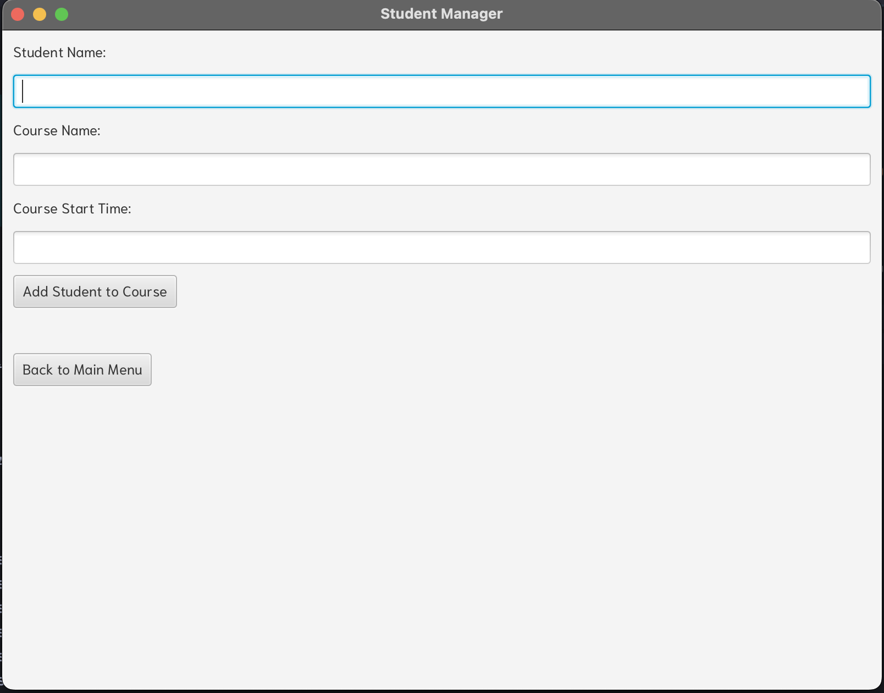
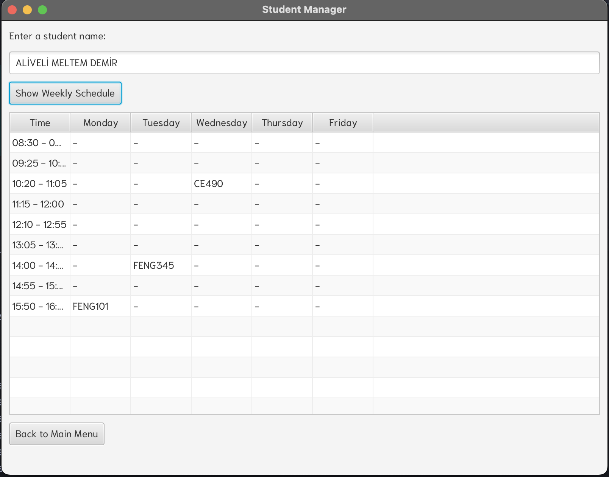
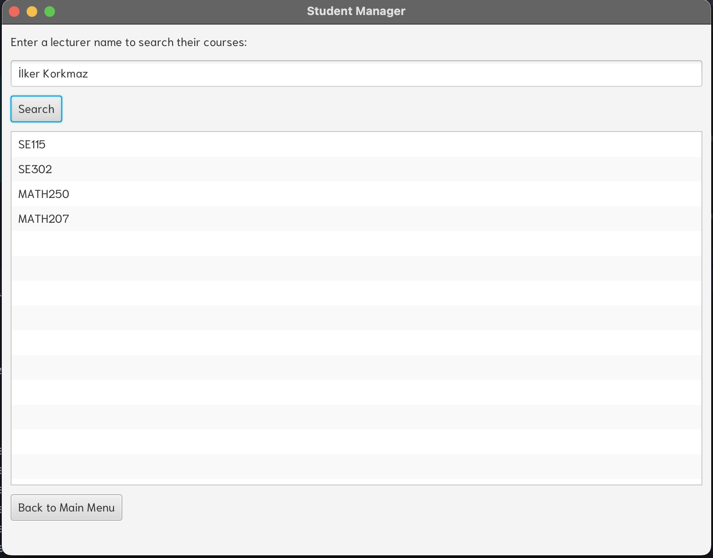
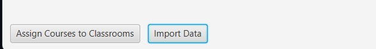
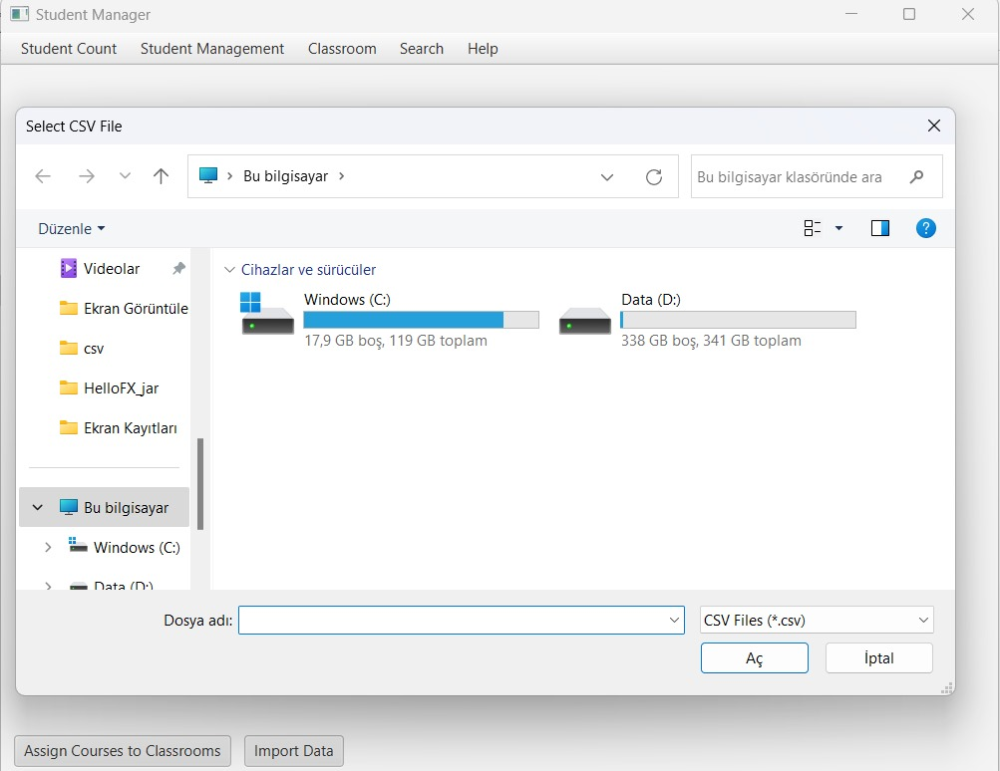

# SE302 PROJECT
This project was developed to help students and lecturers at adding or removing lectures,searching among lecturers and viewing students' schedules.
Here you can find some things you can do by using this application.
## Add student scene

You can add students to courses by entering their name ,course name and start time. Once you add the student classroom capacities increase. And if you exceed the classroom capacity, program reassign the lecture to the another classroom with larger capacity. Also as you can add the student, you can remove the student. Like before, once you removed a student from a course, capacity decreases. 

## Show students' weekly schedule scene

Here is an example of a random student's weekly schedule. You can show students' weekly schedules by entering their names. 

## Search by lecturer scene

You can search by lecturers and see their courses. Also our search button includes two other features. One of them is search course details. By entering a course name you can view it's lecturer,duration,student count and student list. Other one is find available classroom button. Again by entering a course name you can view suitable classrooms according to their capacities. 

## Other Features
- Student Count: You can find student counts of the lectures by searching lecture codes , under the student count button.
- View Classroom Capacities: This button directly shows all classrooms with their capacities.
- Classroom Assignment List: This feature directly shows courses with their student count, assigned classroom ,capacity and time.
- Help Button: You can find how to use details under the help button. All possible questions were explained.
- Alert: When you search lecturers or students you must pay attention to use uppercases. To prevent possible confusions or errors alert message was added. It shows on the screen as soon as you open the program.

## Links
- Our wiki page link: https://github.com/Yaseminkocar/se302-/wiki
- Our task point system list document link: https://docs.google.com/spreadsheets/d/1AlfErOdzXFdeF4O_IQgFmAdyayhcPwo-JS1Y1kXMXhE/edit?usp=sharing

## File Features
- Data Import: When you open the program you must click on the data import button and select the related csv files seperately (courses and classroom capacity)then program will automatically import the files. After that you must click to the assign courses button.
- Program execution: After uploading the files to the application, you need to terminate the application and restart it.

## Documents
- [View user requirements pdf](./USERREQUIREMENTS.pdf)

## Project Management Tool
- Asana: We used asana for our tasks and keeping track of our project.

